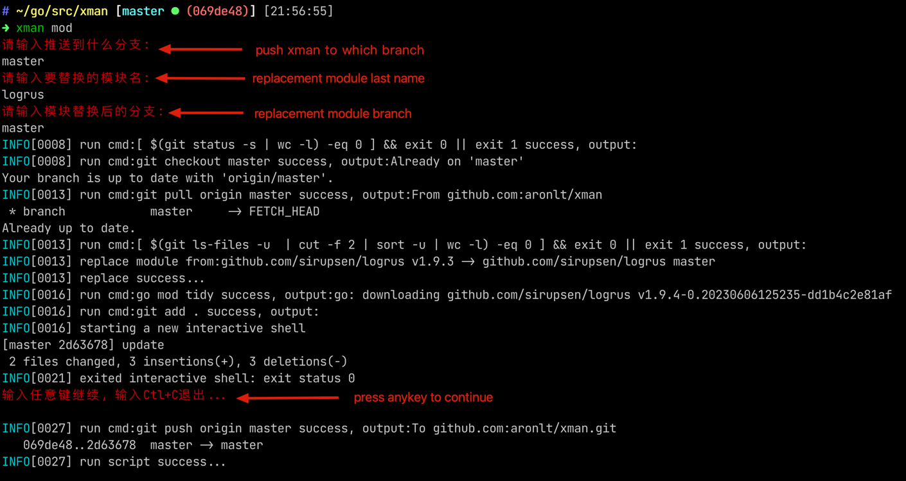
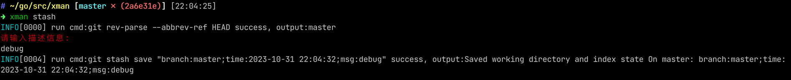
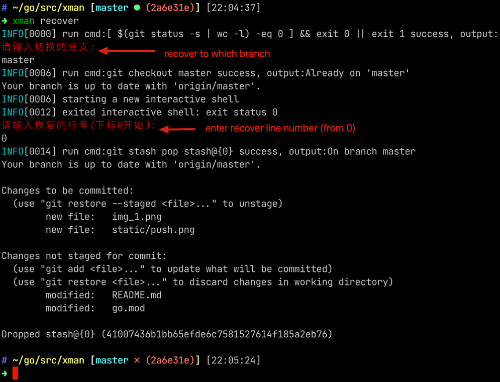

# xman
shell command assistant tool

## How To Use
go to the code directory and run the following script:
```bash
go build . &&
chmod +x xman &&
mv xman /usr/local/bin
```
## commands
#### xman mod
implementing module replacement for the Go language.


#### xman push
automatically complete the local code submission and push the git branch to the remote.


#### xman merge
automatically complete local code submission, merge into the pointed branch, </br> detect conflicts, and push to the remote branch.


#### xman stash
local code temporarily stored (stash).


#### xman recover
the stash code is restored interactively

